# 🛍️ UnderStore - Modern E-Commerce Application


**UnderStore** is a cutting-edge, full-featured e-commerce mobile application built with Flutter. It provides a seamless shopping experience with secure payments, real-time order tracking, and interactive 3D product visualizations. Designed with a sleek dark theme and modern UI components.

## ✨ Key Features

*   **🔐 Secure Authentication:** Robust user sign-up and sign-in using Firebase Auth.
*   **🏠 Dynamic Home:** Featured products, categories, and personalized recommendations.
*   **🔍 Smart Search:** Efficient product search functionality.
*   **📦 3D Product Visualization:** Interactive 3D models for products using `model_viewer_plus`.
*   **🛒 Shopping Cart:** Easy-to-use cart management with real-time updates.
*   **💳 Secure Payments:** Integrated Stripe payment gateway for safe and fast transactions.
*   **📍 Location Services:** Address management with geolocation and map integration (`flutter_map`).
*   **🚚 Order Tracking:** Real-time status updates for orders (Pending, Processing, Delivered).
*   **👤 User Profile:** Comprehensive profile management and order history.
*   **🎨 Modern UI/UX:** Immersive dark theme with smooth animations and gradients.

## 📱 Screenshots

<div align="center">

| Splash | Auth | Login |
|:---:|:---:|:---:|
|  | 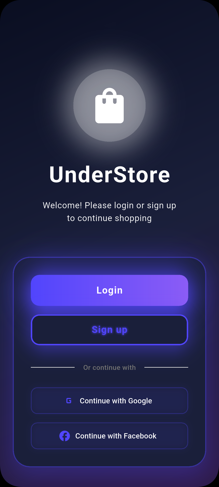 | 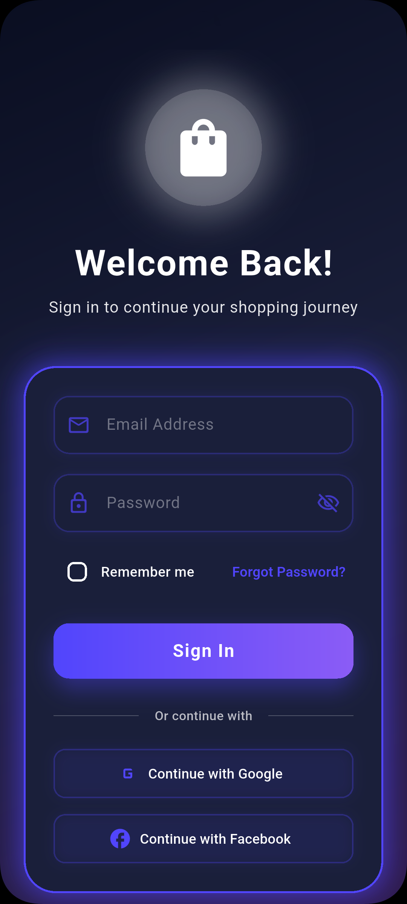 |

| Sign Up | Forgot Password | Home |
|:---:|:---:|:---:|
|  | 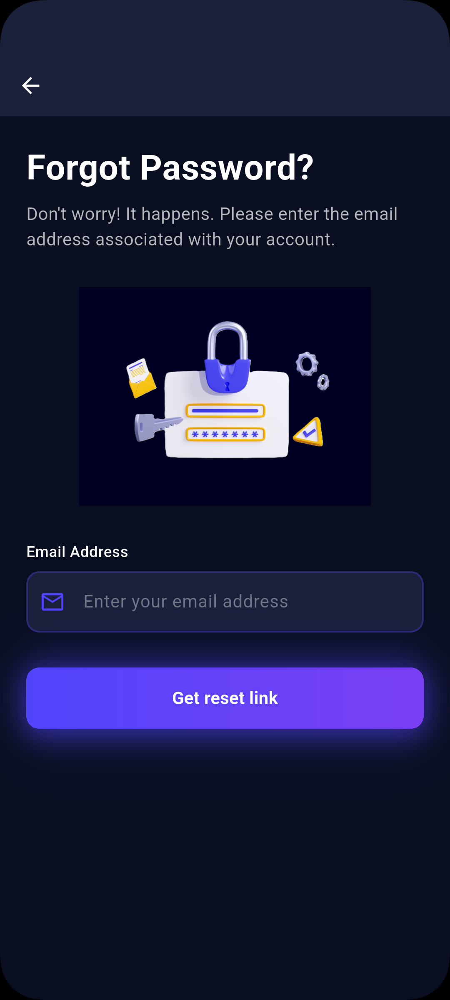 | 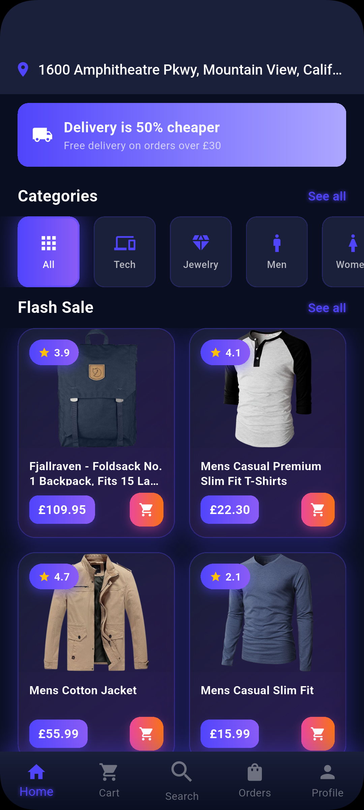 |

| Search | Product Details | 3D View |
|:---:|:---:|:---:|
| 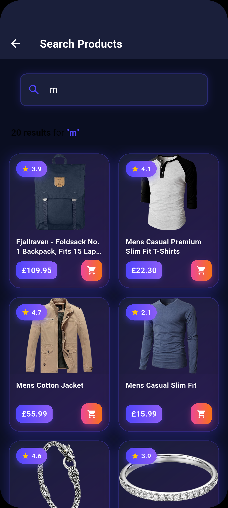 | 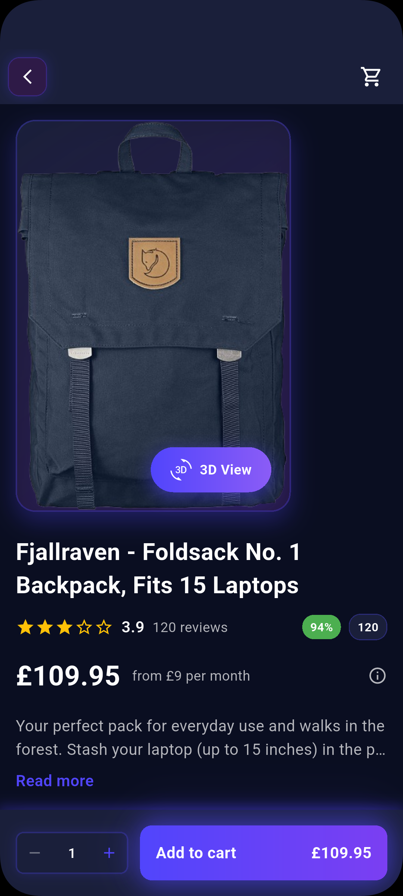 | 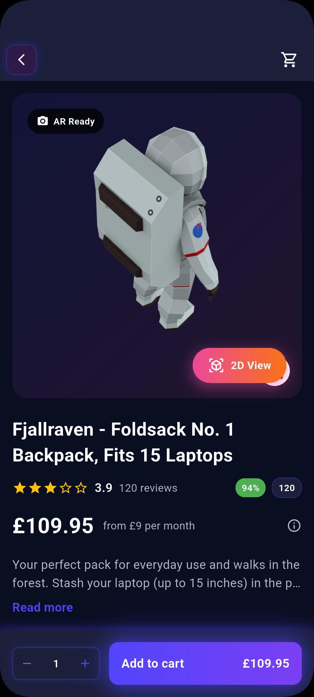 |

| Cart | Delivery Info | Location |
|:---:|:---:|:---:|
|  | 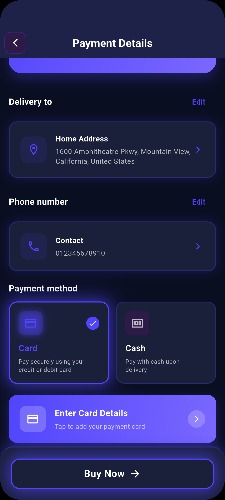 | 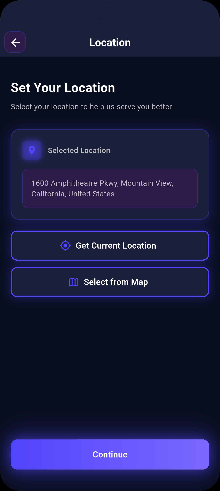 |

| Map | Payment | Payment Gateway |
|:---:|:---:|:---:|
| 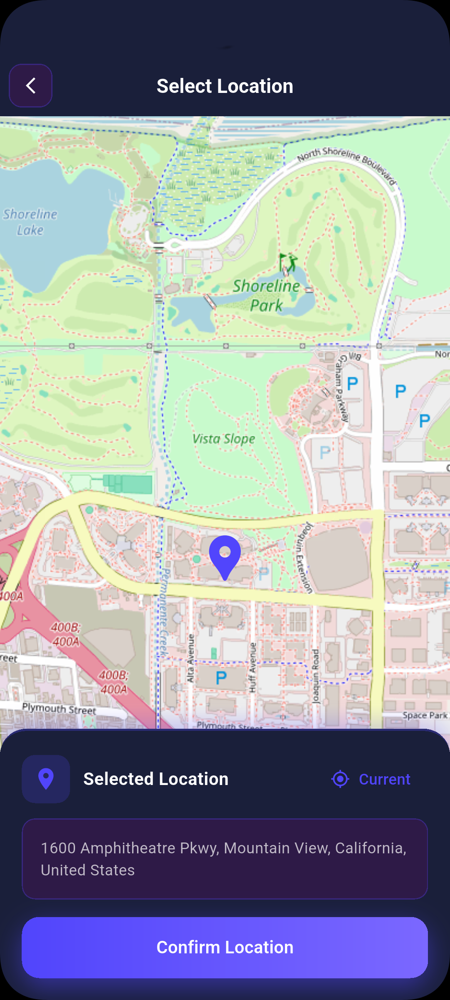 |  | 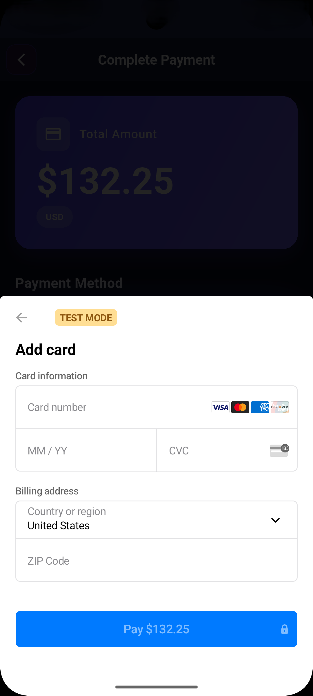 |

| Orders | Profile | Change Password |
|:---:|:---:|:---:|
| 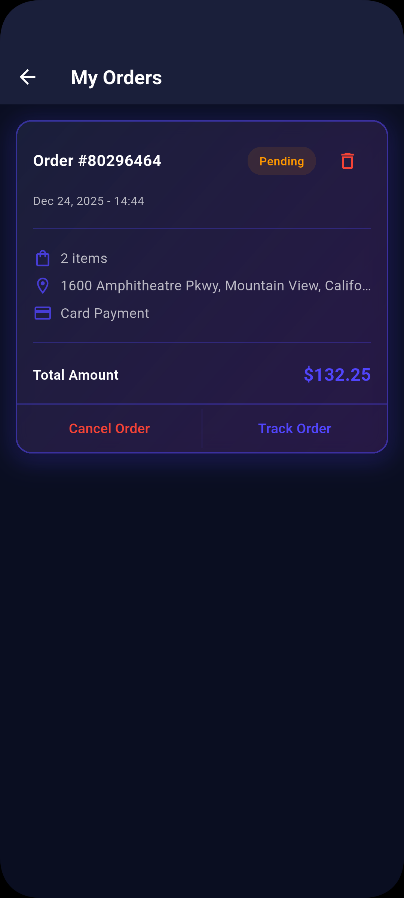 | 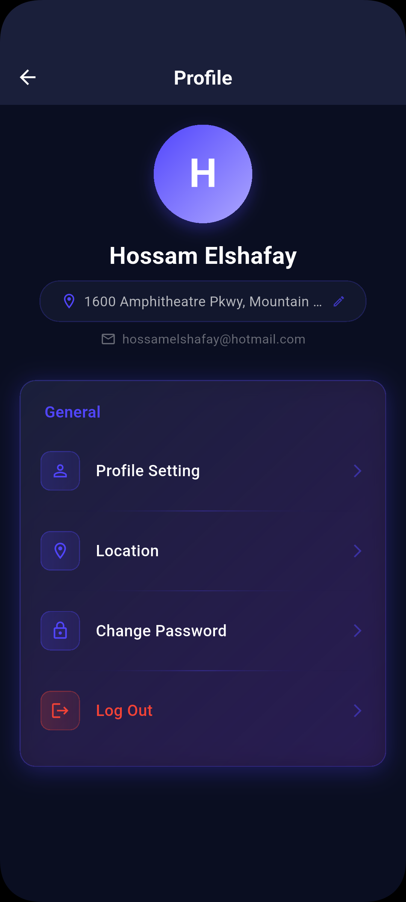 | 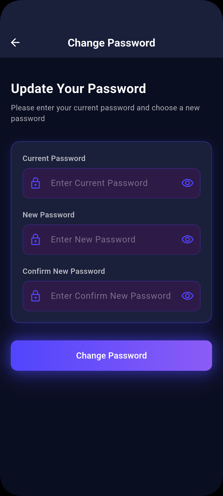 |

</div>

## 🛠️ Tech Stack

*   **Framework:** [Flutter](https://flutter.dev/)
*   **Language:** [Dart](https://dart.dev/)
*   **State Management:** [Bloc / Cubit](https://pub.dev/packages/flutter_bloc) & [GetX](https://pub.dev/packages/get)
*   **Backend:** [Firebase](https://firebase.google.com/) (Auth, Firestore, Cloud Functions)
*   **Payments:** [Stripe](https://stripe.com/)
*   **Maps:** [Flutter Map](https://pub.dev/packages/flutter_map) & [Leaflet](https://leafletjs.com/)
*   **3D Rendering:** [Model Viewer Plus](https://pub.dev/packages/model_viewer_plus)
*   **Architecture:** Feature-first Clean Architecture

## 🚀 Getting Started

### Prerequisites

*   Flutter SDK (Latest version)
*   Dart SDK
*   Android Studio / VS Code
*   Firebase Account
*   Stripe Account

### Installation

1.  **Clone the repository:**
    ```bash
    git clone https://github.com/yourusername/understore.git
    cd understore
    ```

2.  **Install dependencies:**
    ```bash
    flutter pub get
    ```

3.  **Configure Firebase:**
    *   Create a project in the [Firebase Console](https://console.firebase.google.com/).
    *   Add Android and iOS apps.
    *   Download `google-services.json` (Android) and `GoogleService-Info.plist` (iOS) and place them in their respective directories.
    *   Enable Authentication and Firestore Database.

4.  **Configure Stripe:**
    *   Get your Publishable Key from the [Stripe Dashboard](https://dashboard.stripe.com/).
    *   Update the key in `lib/main.dart` or your environment configuration.

5.  **Run the app:**
    ```bash
    flutter run
    ```

## 📂 Project Structure

```
lib/
├── core/                   # Shared utilities, constants, and widgets
├── features/               # Feature-based modules
│   ├── auth/               # Authentication logic & UI
│   ├── cart/               # Shopping cart
│   ├── home/               # Home screen & dashboard
│   ├── location/           # Maps & address management
│   ├── orders/             # Order history & tracking
│   ├── product_details/    # Product view & 3D models
│   ├── profile/            # User settings
│   ├── search/             # Search functionality
│   └── splash/             # App entry point
├── main.dart               # Application entry point
└── firebase_options.dart   # Firebase configuration
```
---

<div align="center">
  Made by Hossam Elshafay
</div>
